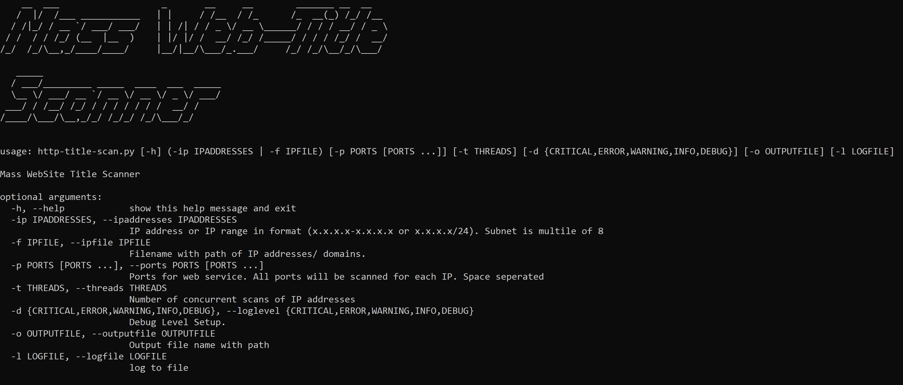

# http-title-scan
Connects to the ports via http or https (only if port has 443 in it) extracts title tag value and exports in file.

## Help menu

### Logs
Logging module is used for logging errors/ warnings/ information etc. Default value is info. To store logs provide logfile parameter.

##Warning
For Windows signal handler is not working at the moment.